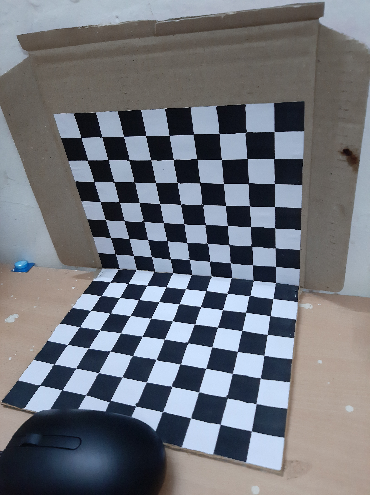
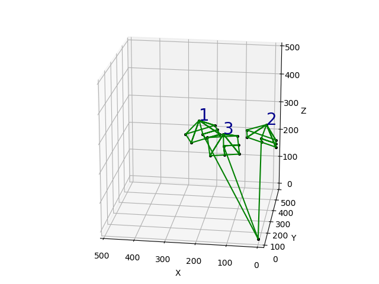
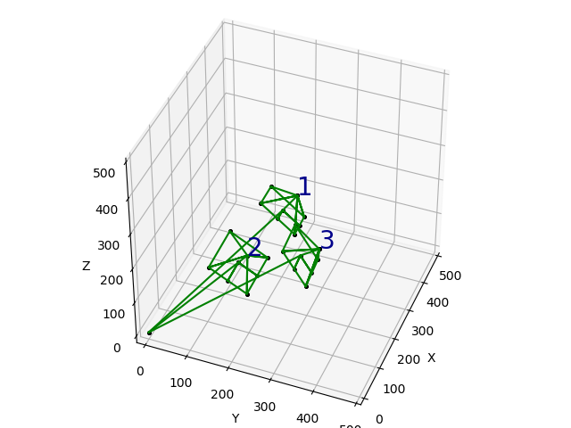

# TSAI Camera Calibration
Implementation of TSAI Camera Calibration. 
Used to compute the Extrinsics and Intrinsics of the camera using a calibration board.

The Reprojection error is also calculated using the computed extrinsics and intrinsics.

## Extrinsics visualization
These are the 3 views: 

  
  
  

 
 
The camera locations in world coordinates are:

  
  

